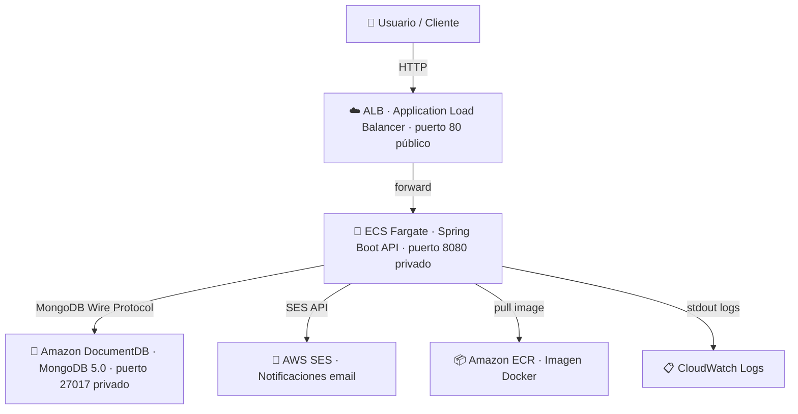

# technical-test-fondos

**Prueba técnica:** Plataforma de Gestión de Fondos de Inversión

> ⚠️ **Disclaimer:** Este repositorio no corresponde a código oficial de BTG Pactual. Es únicamente una prueba técnica personal desarrollada como parte de un proceso de selección. Ningún dato, credencial ni infraestructura aquí descrita tiene relación con los sistemas reales de la empresa.

## Descripción

API REST para la gestión de fondos de inversión. Permite a los clientes suscribirse y cancelar fondos, consultar historial de transacciones y recibir notificaciones por email (AWS SES) o SMS.

## Stack Tecnológico

| Tecnología | Versión | Uso |
|---|---|---|
| **Java** | 17 (Temurin) | Lenguaje principal |
| **Spring Boot** | 3.5.12 | Framework backend |
| **Spring Security** | 6.x | Autenticación y autorización |
| **JJWT** | 0.12.7 | Generación/validación de tokens JWT |
| **MongoDB** | 7.0 | Base de datos local |
| **Amazon DocumentDB** | 5.0 | Base de datos en producción (AWS) |
| **AWS SES SDK** | 2.25.60 | Envío de emails de notificación |
| **Gradle** | 8.7 (Groovy) | Build tool |
| **Docker** | - | Contenedorización |
| **AWS CloudFormation** | - | Infraestructura como código |

## Arquitectura

### Capas de la aplicación
```
controller/ → service/ → repository/ → MongoDB/DocumentDB
     ↓
  security/ (JWT Filter)
     ↓
  exception/ (Global Handler)
     ↓
  notification/ (AWS SES / Log fallback)
```

### Arquitectura AWS



> **Justificación:** ECS Fargate elimina la administración de servidores. DocumentDB es compatible con el driver MongoDB y escala de forma gestionada. La VPC con subnets privadas garantiza que DocumentDB nunca quede expuesto a internet.

## Modelo de Datos

| Colección      | Campos principales                                                         |
|----------------|----------------------------------------------------------------------------|
| `clients`      | id, name, email, phone, password, role, balance, subscriptions, version    |
| `funds`        | id, name, minimumAmount, category                                          |
| `transactions` | id, clientId, fundId, fundName, type (SUBSCRIBE/CANCEL), amount, timestamp |

## Fondos Disponibles (datos semilla)

| ID | Nombre                          | Monto mínimo   | Categoría |
|----|----------------------------------|-----------------|-----------|
| 1  | FPV_BTG_PACTUAL_RECAUDADORA     | COP $75.000     | FPV       |
| 2  | FPV_BTG_PACTUAL_ECOPETROL       | COP $125.000    | FPV       |
| 3  | DEUDAPRIVADA                     | COP $50.000     | FIC       |
| 4  | FDO-ACCIONES                     | COP $250.000    | FIC       |
| 5  | FPV_BTG_PACTUAL_DINAMICA        | COP $100.000    | FPV       |

## API Endpoints

### Públicos (sin autenticación)
| Método | Endpoint             | Descripción           |
|--------|----------------------|-----------------------|
| POST   | `/api/auth/register` | Registrar usuario     |
| POST   | `/api/auth/login`    | Login (retorna JWT)   |
| GET    | `/health`            | Health check          |

### Protegidos (requieren Bearer Token)
| Método | Endpoint                      | Descripción               |
|--------|-------------------------------|---------------------------|
| GET    | `/api/funds`                  | Listar fondos disponibles |
| POST   | `/api/funds/{id}/subscribe`   | Suscribirse a un fondo    |
| POST   | `/api/funds/{id}/cancel`      | Cancelar suscripción      |
| GET    | `/api/transactions`           | Historial de transacciones|
| GET    | `/api/clients/me`             | Ver perfil y saldo        |

---

## Ejecución Local

### Prerrequisitos
- Java 17 (JDK)
- Docker y Docker Compose

### Pasos

```bash
# 1. Iniciar MongoDB
docker compose up -d

# 2. Compilar y ejecutar
./gradlew bootRun

# 3. Ejecutar tests
./gradlew test
```

```powershell
# Windows PowerShell
docker compose up -d
.\gradlew.bat bootRun
.\gradlew.bat test
```

La API estará disponible en `http://localhost:8080`.

### Variables de entorno (Se deben configurar antes de iniciar la API)

| Variable | Default | Descripción |
|---|---|---|
| `MONGODB_URI` | `mongodb://localhost:27017/btg_fondos` | URI de conexión MongoDB |
| `SERVER_PORT` | `8080` | Puerto del servidor |
| `JWT_SECRET` | (generado) | Secreto para firmar tokens JWT |
| `JWT_EXPIRATION_MS` | `86400000` (24h) | Tiempo de expiración del token |
| `CORS_ALLOWED_ORIGINS` | `*` | Orígenes permitidos para CORS |
| `INITIAL_BALANCE` | `500000` | Saldo inicial de nuevos clientes |
| `SES_ENABLED` | `false` | Habilitar envío real de emails via SES |
| `SES_SENDER_EMAIL` | `noreply@example.com` | Email remitente (debe estar verificado en SES) |
| `SES_REGION` | `us-east-1` | Región de AWS SES |

### Ejemplo de uso con cURL

```bash
# Registrar usuario
curl -X POST http://localhost:8080/api/auth/register \
  -H "Content-Type: application/json" \
  -d '{"name":"Juan","email":"juan@test.com","password":"Password1!","notificationPreference":"EMAIL"}'

# Login (copiar el token de la respuesta)
curl -X POST http://localhost:8080/api/auth/login \
  -H "Content-Type: application/json" \
  -d '{"email":"juan@test.com","password":"Password1!"}'

# Listar fondos (usar el token obtenido)
curl http://localhost:8080/api/funds -H "Authorization: Bearer <TOKEN>"

# Suscribirse a un fondo
curl -X POST http://localhost:8080/api/funds/1/subscribe -H "Authorization: Bearer <TOKEN>"

# Ver historial
curl http://localhost:8080/api/transactions -H "Authorization: Bearer <TOKEN>"

# Cancelar suscripción
curl -X POST http://localhost:8080/api/funds/1/cancel -H "Authorization: Bearer <TOKEN>"

# Ver perfil
curl http://localhost:8080/api/clients/me -H "Authorization: Bearer <TOKEN>"
```

> **Nota:** La contraseña debe tener mínimo 8 caracteres e incluir mayúscula, minúscula, número y carácter especial (@$!%*?&).

---

## Despliegue en AWS

### Prerrequisitos
- AWS CLI instalado y configurado (`aws configure`)
- Docker instalado y corriendo
- Usuario IAM con permisos: CloudFormation, EC2, ECS, ECR, ELB, DocumentDB, IAM, Logs, SES

### Opción 1: Script automatizado (recomendado)

```powershell
cd btg-fondos

# Primera vez (crea todo desde cero)
.\deploy.ps1 -SenderEmail "tu-email@gmail.com"

# Actualizaciones posteriores (solo rebuild + redeploy)
.\deploy.ps1
```

**Parámetros del script:**

| Parámetro | Default | Descripción |
|---|---|---|
| `-StackName` | `btg-fondos` | Nombre del stack CloudFormation |
| `-Region` | `us-east-1` | Región AWS |
| `-RepoName` | `btg-fondos` | Nombre del repositorio ECR |
| `-ImageTag` | `latest` | Tag de la imagen Docker |
| `-SenderEmail` | (vacío) | Email verificado en SES |
| `-JwtSecret` | (pregunta) | Secreto JWT (solo en creación) |
| `-DocDBPassword` | (pregunta) | Password DocumentDB (solo en creación) |

En la primera ejecución, el script solicita interactivamente el JWT Secret y la contraseña de DocumentDB. En ejecuciones posteriores, reutiliza los valores existentes.

### Opción 2: Paso a paso manual

#### 1. Definir variables

```powershell
$AWS_ACCOUNT_ID = aws sts get-caller-identity --query Account --output text
$AWS_REGION = "us-east-1"
$ECR_URI = "$AWS_ACCOUNT_ID.dkr.ecr.$AWS_REGION.amazonaws.com/btg-fondos"
```

#### 2. Crear repositorio ECR

```powershell
aws ecr create-repository --repository-name btg-fondos --region $AWS_REGION
```

#### 3. Build y push de la imagen Docker

```powershell
# Login en ECR
aws ecr get-login-password --region $AWS_REGION | docker login --username AWS --password-stdin "$AWS_ACCOUNT_ID.dkr.ecr.$AWS_REGION.amazonaws.com"

# Build, tag y push
docker build -t btg-fondos .
docker tag btg-fondos:latest "${ECR_URI}:latest"
docker push "${ECR_URI}:latest"
```

#### 4. Verificar email en SES (para notificaciones)

```powershell
aws ses verify-email-identity --email-address tu-email@gmail.com --region us-east-1
```

Confirmar el enlace que llega al email.

#### 5. Crear el stack de CloudFormation

```powershell
aws cloudformation create-stack --stack-name btg-fondos --template-body file://cloudformation.yml --capabilities CAPABILITY_NAMED_IAM --parameters "ParameterKey=AppImage,ParameterValue=${ECR_URI}:latest" "ParameterKey=JwtSecret,ParameterValue=TuSecretoJWTSeguroDeAlMenos32Caracteres!!" "ParameterKey=DocDBMasterPassword,ParameterValue=TuPasswordDB123!" "ParameterKey=SesSenderEmail,ParameterValue=tu-email@gmail.com" --region us-east-1
```

> ⚠️ Reemplazar `JwtSecret` (mín. 32 chars) y `DocDBMasterPassword` (mín. 8 chars) con valores propios.

#### 6. Esperar a que el stack se cree (~15-20 minutos)

```powershell
aws cloudformation wait stack-create-complete --stack-name btg-fondos --region us-east-1
```

#### 7. Obtener la URL de la API

```powershell
aws cloudformation describe-stacks --stack-name btg-fondos --query "Stacks[0].Outputs[?OutputKey=='APIEndpoint'].OutputValue" --output text --region us-east-1
```

#### 8. Verificar

```powershell
curl http://<ALB_URL>/health
```

### Actualizar la aplicación (después de cambios en el código)

```powershell
# Rebuild y push
docker build -t btg-fondos .
docker tag btg-fondos:latest "${ECR_URI}:latest"
docker push "${ECR_URI}:latest"

# Forzar redespliegue en ECS
aws ecs update-service --cluster btg-fondos-cluster --service <SERVICE_NAME> --force-new-deployment --region us-east-1
```

### Eliminar todos los recursos

```powershell
# 1. Eliminar stack CloudFormation (VPC, ECS, DocumentDB, ALB, etc.)
aws cloudformation delete-stack --stack-name btg-fondos --region us-east-1
aws cloudformation wait stack-delete-complete --stack-name btg-fondos --region us-east-1

# 2. Eliminar repositorio ECR
aws ecr delete-repository --repository-name btg-fondos --force --region us-east-1
```

### Recursos creados por CloudFormation

| Recurso | Descripción |
|---|---|
| **VPC** | Red con 2 subnets públicas + 2 privadas |
| **NAT Gateway** | Acceso a internet desde subnets privadas |
| **ALB** | Load Balancer público (puerto 80) |
| **ECS Fargate** | Servicio serverless (512 CPU, 1GB RAM) |
| **DocumentDB** | Base de datos (db.t3.medium, engine 5.0) |
| **IAM Roles** | Execution Role (ECR/Logs) + Task Role (SES) |
| **CloudWatch Logs** | Logs del contenedor (retención 14 días) |

---

## Notificaciones

La aplicación envía notificaciones por email al suscribirse o cancelar un fondo.

- **En AWS**: usa Amazon SES para enviar emails reales (requiere `SES_ENABLED=true` y un email verificado)
- **En local**: las notificaciones se simulan via logs (no requiere configuración)

> En modo sandbox de SES, tanto el email remitente como el destinatario deben estar verificados.

---

## Seguridad

- **Autenticación**: JWT con expiración configurable (default 24h)
- **Autorización**: Roles `ROLE_USER` / `ROLE_ADMIN`
- **Contraseñas**: BCrypt + política de complejidad (8+ chars, mayúscula, minúscula, número, especial)
- **Concurrencia**: Optimistic locking con `@Version` en el modelo Client
- **CORS**: Orígenes configurables via variable de entorno
- **TLS**: DocumentDB con TLS habilitado (certificados AWS importados en el Dockerfile)

---

## Pruebas

```bash
./gradlew test
```

Tests unitarios implementados (10 tests):
- ✅ Suscripción exitosa (reduce saldo, crea transacción, envía notificación)
- ✅ Suscripción con saldo insuficiente
- ✅ Suscripción duplicada
- ✅ Fondo no encontrado
- ✅ Cancelación exitosa (devuelve saldo)
- ✅ Cancelación sin estar suscrito
- ✅ Listar fondos
- ✅ Suscripciones múltiples
- ✅ Historial de transacciones por cliente
- ✅ Historial vacío

---

## Decisiones Técnicas

1. **MongoDB/DocumentDB**: Modelo NoSQL con suscripciones embebidas dentro del documento Client para optimizar lecturas.
2. **JWT Stateless**: Sin sesiones en servidor, ideal para escalar horizontalmente con ECS.
3. **Optimistic Locking**: Campo `@Version` en Client para prevenir condiciones de carrera sin necesidad de replica set.
4. **AWS SES**: Integración real de notificaciones por email con fallback a logging para desarrollo local.
5. **Docker multi-stage**: Imagen final ligera (~217MB) con solo JRE Alpine + certificados TLS.
6. **CloudFormation**: Infraestructura completa como código, reproducible y eliminable en un solo comando.
7. **Script de despliegue**: `deploy.ps1` automatiza todo el ciclo: ECR → Build → Push → CloudFormation.
